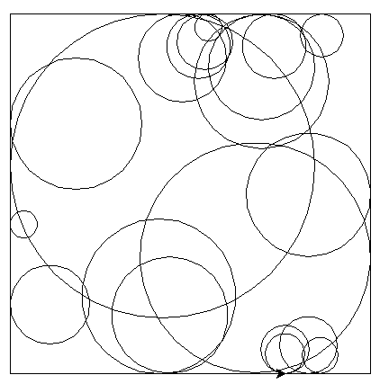
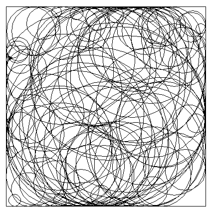

Exercices : boucle conditionnelle
=================================

Exercice 1
----------

Indiquer la valeur des variables après exécution du code !

#. Variable ``a``:

   .. literalinclude:: ../python/exercice_2.py
      :lines: 1-3

#. Variable ``b``:

   .. literalinclude:: ../python/exercice_2.py
      :lines: 5-7

#. Variables ``c`` et ``d``:

   .. literalinclude:: ../python/exercice_2.py
      :lines: 9-13
      
#. Variable ``e``:

   .. literalinclude:: ../python/exercice_2.py
      :lines: 15-17

#. Variable ``f``:

   .. literalinclude:: ../python/exercice_2.py
      :lines: 19-21

#. Variable ``g``:

   .. literalinclude:: ../python/exercice_2.py
      :lines: 23-25

#. Variables ``h`` et ``i``:

   .. literalinclude:: ../python/exercice_2.py
      :lines: 27-31

#. Variables ``j`` et ``k``:

   .. literalinclude:: ../python/exercice_2.py
      :lines: 33-40

#. Variables ``m`` et ``n``:

   .. literalinclude:: ../python/exercice_2.py
      :lines: 42-46

Exercice 2
----------

Écrire des boucles conditionnelles pour :

1. Afficher dans l'ordre : 8, 7, 6, 5, 4, 3, 2, 1, 0
2. Afficher dans cet ordre : 1, 3, 5, 7, 9, 11
3. Afficher dans cet ordre : 1, 10, 100, 1000, 10000, 100000, 1000000
4. Afficher dans cet ordre : 1, -1, 1, -1, 1, -1, 1, -1, 1

.. tip::

   Pour afficher sur une même ligne les valeurs avec la fonction ``print``, il suffit d'ajouter l'argument ``end = ' '`` à la fonction.
   
   Par exemple : ``print(i, end=' ')``.

Exercice 3
----------

Le jeu du **plus** ou **moins** consiste à deviner un nombre entier choisi au hasard par la machine entre 1 et 1000. A chaque proposition:

- si on trouve le nombre, on a gagné et le jeu prend fin.
- si on ne trouve pas le nombre, on reçoit l'information **plus grand** ou **moins grand** et le jeu continue.

On doit écrire un code en Pthon qui modélise ce jeu.

1. Importer le module nécessaire au choix aléatoire d'un nombre entier.
2. Créer 2 variables ``n`` et ``rep``.

   - ``n`` est le nombre à deviner choisi aléatoirement
   - ``rep`` est un booléen qui vaut ``False``
   
3. La saisie du nombre est enregistrée dans la variable ``prop``. 

   Elle se réalise avec l'instruction: ``prop = int(input("proposer un nombre entre 1 et 1000: "))``
   
4. Écrire un code qui propose la saisie d'un nombre tant qu'on n'a pas trouvé le nombre à deviner. 

Exercice 4
----------

Sur les figures ci-dessous, on a tracé aléatoirement des cercles dans un carré qui sont tangents aux côtés du carré. 

**Avec 20 cercles**

**Avec 100 cercles**

      
Le programme doit respecter les contraintes suivantes:

- le centre de chaque cercle est choisi au hasard
- le rayon de chaque cercle est supérieur à 10
- le carré à un côté de 400
- on tracera au moins 20 cercles.
- la boucle est une boucle ``while``

Exercice 6
----------

La Conjecture de syracuse appelée suite de Syracuse calcule une suite de nombres selon leur parité (pair ou impair). On utilisera une file pour stocker les valeurs de nos différentes suites de Syracuse. 

.. _`wikipedia`: https://fr.wikipedia.org/wiki/Conjecture_de_Syracuse

Après avoir lu l'article sur `wikipedia`_, nous allons construire différentes fonctions en Python pour calculer les nombres de cette suite.

1. Les nombres de la suite de Syracuse se calcule de la façon suivante:

   - on part d'un nombre entier ``n``
   - si ``n`` est pair, on le divise par 2 ; ``n`` prend cette nouvelle valeur
   - si ``n`` est impair, on le multiplie par 3 et on ajoute 1; ``n`` prend cette nouvelle valeur
   - Tant que ``n`` n'est pas égal à 1, on recommence.
   
   Écrire la fonction ``syracuse`` de paramètre n, nombre entier, qui calcule et affiche les nombres de la suite de syracuse.

2. On associe les nombres de syracuse à la trajectoire d'une feuille morte et on parle du vol de la suite. Trois valeurs symbolisent ce vol : le temps de vol, le temps de vol en altitude et l'altitude maximale.

   .. admonition:: Exemple
   
      On calcule les termes de la suite pour N=129 et détermine les valeurs:

      - Le temps de vol pour N=129 est 121.
      - Le temps de vol en altitude pour N=129 est 2.
      - L'altitude maximale pour N=129 est 9232.

   a. Écrire la fonction ``temps_de_vol`` de paramètre ``n`` qui renvoie la valeur associée au temps de vol.
   b. Écrire la fonction ``vol_en_altitude`` de paramètre ``n`` qui renvoie la valeur associée au temps de vol en altitude.
   c. Écrire la fonction ``altitude_max`` de paramètre ``n`` qui renvoie la valeur associée à l'altitude maximale.
   
